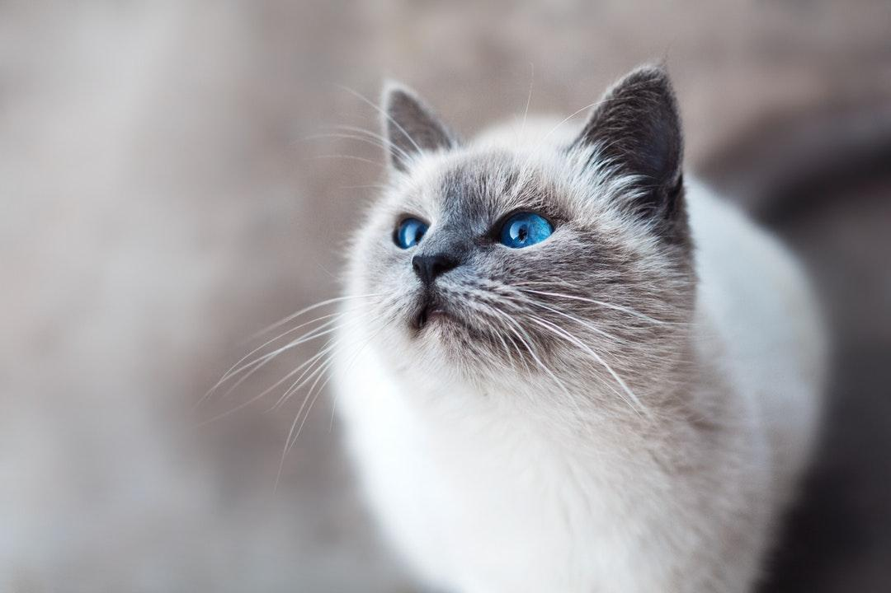
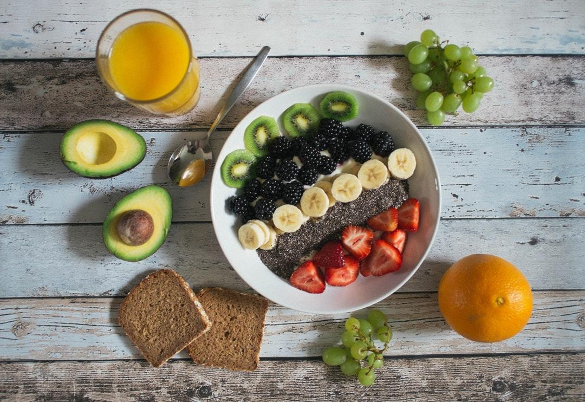
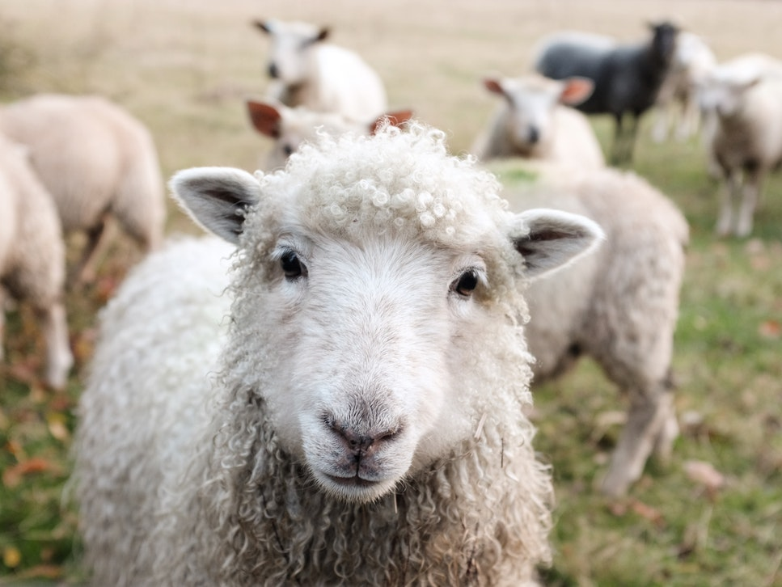
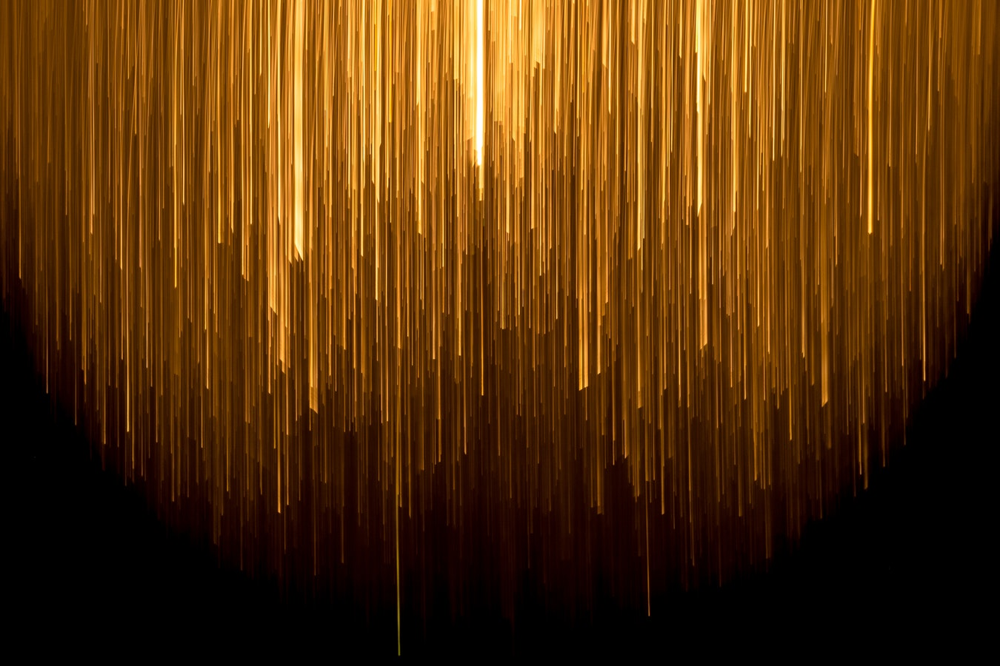
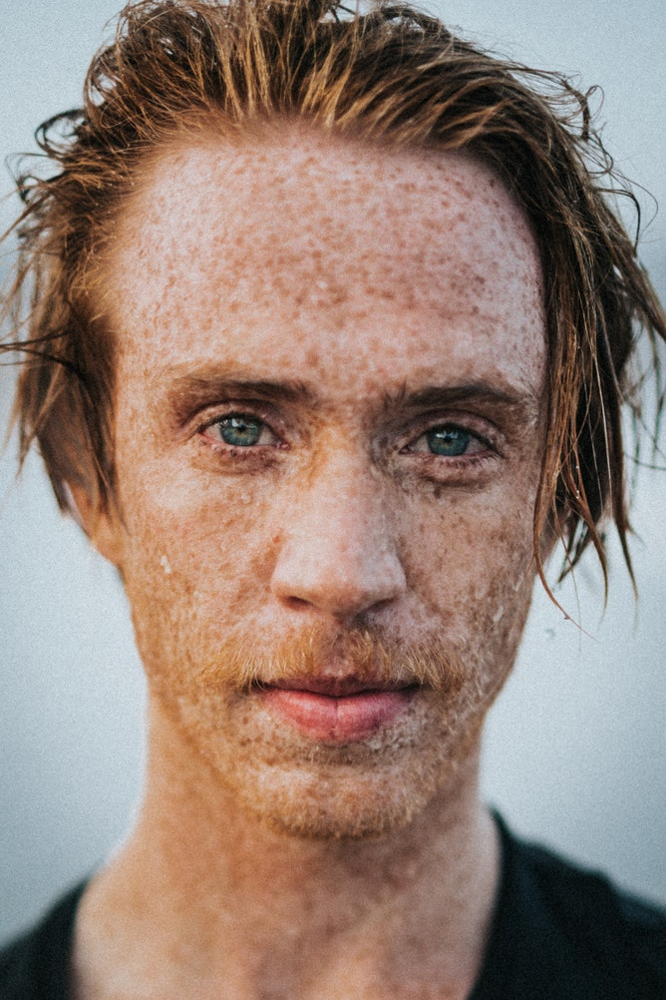
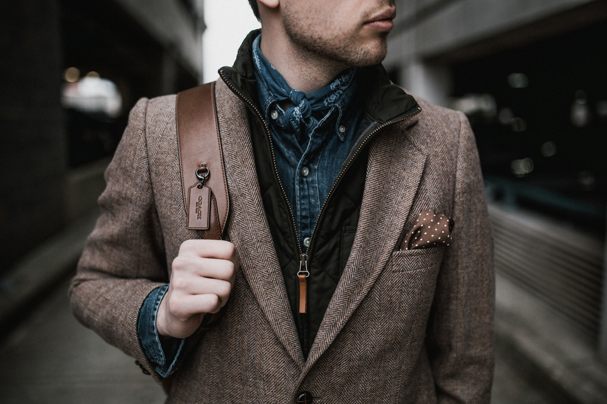

Best Practices
===============

Image examples
---------------

We've handpicked some example images that display which kind of data the models
have been optimized for.
If you observe that your images don't work well with our models please let us know
by sending an email to support@mobius.ml.

.. |img5| image:: data/example_img/Interior/photo-1522444195799-478538b28823.jpeg
  :scale: 20%
  :align: top

.. |img10| image:: data/example_img/Sports/photo-1518216774616-e17ccffe21c9.jpeg
  :scale: 20%
  :align: top

.. |img13| image:: data/example_img/Minimal/photo-1504596217249-cef2ad2d6b53.jpeg
  :scale: 20%
  :align: top

.. table:: Table with example images
    :widths: 30 30 30

    +---------+---------+---------+
    | |img1|  | |img2|  | |img3|  |
    +---------+---------+---------+
    | |img4|  | |img5|  | |img6|  |
    +---------+---------+---------+
    | |img7|  | |img8|  | |img9|  |
    +---------+---------+---------+
    | |img10| | |img11| | |img12| |
    +---------+---------+---------+
    | |img13| | |img14| | |img15| |
    +---------+---------+---------+

Image sizes and ratios
------------------------
As our example image grid shows, images in real life come in all kinds of ratios.
This SDK will automatically scale the input images to a small square size that we use for
the analysis internally.

Special image categories
---------------------------
This SDK can analyse a wide range of images. However, there are also limitations on
the input data. Currently it only supports RGB images - especially higher dimensions
such as additional depth data is not supported yet.
There are also certain categories of industrial image data that might not give good results with this SDK.
Also this SDK has not been certified for analysing medical data such as X-ray, CT or MRT images.
Specifically, we have not taken into account this in terms of the EU-GDPR regulations.
We cannot give any warranty if you want to use this SDK for these sensitive data types.

Keyword confidence levels
----------------------------

Our keywords come with confidence levels. So the machine does not only tell which
keywords it found in an image but also how certain it is about it.
The confidence levels are carefully adjusted according to the importance and granularity of an keyword.
