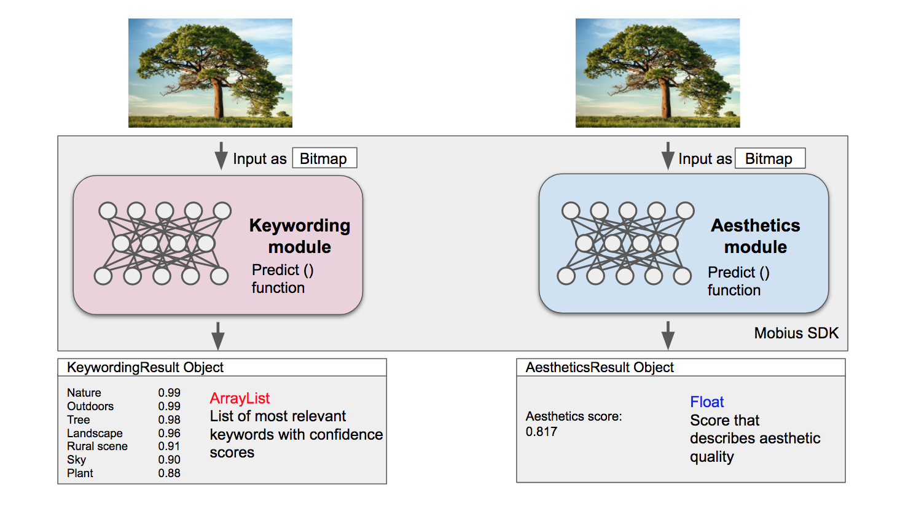

Getting Started and Prediction
================================

Loading the SDK
------------------

To load the SDK, create one instance of the :java:`MobiusSDK` class inside your activity:

::

  public class MainActivity extends AppCompatActivity {
    ...
    MobiusSDK.load(this.getAssets());
    //Check if the SDK was correctly loaded
    if (!MobiusSDK.isOperational()){...}
    ...
  }

Prediction overview
---------------------

The predict function generally takes an image as input and returns a result object. The result objects vary according to the use case. When using the keywording model, a :java:`KeywordingResult` object will be returned. Please also refer to the illustration below for details. 

.. prediction illustration here

Prediction with Pre-trained Modules
--------------------------------------

|sdk_name| is shipped with two modules that were trained on our large image dataset.
These *pre-trained modules* can be used to obtain predictions for a wide range of applications.

Illustration of the prediction feature for keywording and aesthetics:

Keywording
^^^^^^^^^^^^^^

This is an example for prediction with our standard keywording model:

::

  KeywordingResult keywordingResult = MobiusSDK.predictKeywords(bitmap);
  //Returns thresholded results with default threshold
  ArrayList<Keyword> keywords = keywordingResult.getThresholdedResult();

From the returned :java:`KeywordingResult` object an ArrayList can be extracted with all keywords that were detected in the image above the default threshold. 

.. note::

  The default threshold is 0.55. That means that for a keyword to be returned, the model has to have at least 55% confidence that this keyword is present in the image. It is possible to set a custom threshold by passing a float value to the function like this: :java:`getThresholdedResult(0.6)`. This float value should be greater than 0 and smaller than 1. 

You can get a particular label(String) or confidence(Float) from the list as follows :

::

  String label = keywords.get(i).getLabel(); 
  Float confidence = keywords.get(i).getConfidence(); //confidence of the model in the keyword

The confidence can be understood as a percentage of how certain the model is that this keyword belongs to the image. In a very broad sense our model is trained to return basic keywords such as 'people', 'animals' or 'outdoors' with high confidence, while very specific keywords are returned with lower confidence. 

.. note::

  For some simple images, the keywording module might only recognise a small number of matching keywords.
  However, in cluttered scenes, there might be a long list of matching keywords. Depending of the image, the number
  of returned keywords might vary. If no keywords are returned this might mean that the threshold was too high and there was no keyword where the model was sufficiently confident to return as result.

There is also a function to obtain the top k keywords ordered descending according to the confidence. This function returns
the same number of keywords for any image.

::

  //Returns top-k results with default k value of 15
  ArrayList<Keyword> keywords = keywordingResult.getTopK();
  //Returns top-k results with custom k value
  ArrayList<Keyword> keywords = keywordingResult.getTopK(20);

.. note::

  It is theoretically possible to select an integer value between 1 and the total number of keywords in the model. However, large values of k are likely to result in a large number of keywords will low confidence and therefore it is more likely to see wrong labels. The value of k should be carefully adjusted according to the use case and image data. 
  
.. note::

  ProTip: It's possible to use a conservative threshold or k value for keywording to only display keywords with very high confidence while still making the images searchable with a large number of tags. This SDK comes with a search function that uses the extracted features instead of the plain output tags for search. Therefore, it is possible to find an image for a query keyword although that query keyword was not returned in the prediction step. 

Aesthetics
^^^^^^^^^^^

Prediction with the aesthetics module works in a similar manner as the keywording module. Also in this case a specific :java:`AestheticsResult` object is returned from the predictAesthetics function of the |sdk_name|. 

::

  AestheticsResult aestheticsResult = MobiusSDK.predictAesthetics(bitmap);
  float aestheticsScore = aestheticsResult.getScore(); //Returns normalized aesthetics score

.. note::

  The aesthetics score is normalized, that means that it will always be a value between 0 and 1 which only depends on the aesthetics of the input image to this function. 

Prediction on features
-------------------------

For both Keywording and Aesthetics, you can do predictions on the features as well instead of the Bitmap image like this:

::

  KeywordingResult keywordingResult = MobiusSDK.predictKeywords(float[] combinedFeatures);
  AestheticsResult aestheticsResult = MobiusSDK.predictAesthetics(float[] combinedFeatures);

Caching of features can be very useful since the method for extracting the features from a bitmap is computationally very expensive. Using the features for prediction is computationally far less expensive. In a case where predictions would be carried out repeatedly on the same image, caching can be used to significantly speeding up the processing. Keeping the features in cache is also necessary when using the builtin search function of the SDK and training custom models. 

.. todo::

  Put cache example code here

Prediction with a customised model
------------------------------------

This SDK also offers the option to train custom models on top of our pre-trained models. If a custom model has been just trained or a trained model has been loaded the procedure is slightly different compared to the previous sections.

In this case, you need to specify a key for every trained |model|. If a customized |model| has been trained already:

::

  //Loading a custom  model for example (here called mainCustomModelFileName) can done as follows
  String path = this.getFilesDir().getPath() + "/" + mainCustomModelFileName;
  try{
      MobiusSDK.loadCustomModel(customModelKey, path);} //A new model is automatically created in the SDK
  catch (FailedLoadingModelException e) {...}
  //if the custom model model was already trained
  if(MobiusSDK.CustomModelisTrained()){
      float predictedScore = MobiusSDK.predictCustomModel(customModelKey, bitmap).getScore();}

You can also classify by using the default threshold or a custom threshold :

::

  Boolean prediction = MobiusSDK.predictCustomModel(customModelKey, bitmap).classify(); //default threshold
  Boolean prediction = MobiusSDK.predictCustomModel(customModelKey, bitmap).classify(0.7f); //custom threshold

If the features are cached, custom model prediction can be much faster by calling predictCustomModel on the features instead of the bitmap :

::

  float predictedScore = MobiusSDK.predictCustomModel(customModelKey, float[] features).getScore();

You can also use features to predict with a customized model. 

.. (Prediction with large number of images)

.. (For many applications there might be a need to process many images. Prediction is much faster than training a model, yet it is computationally expensive. This section would need a code snippet)

