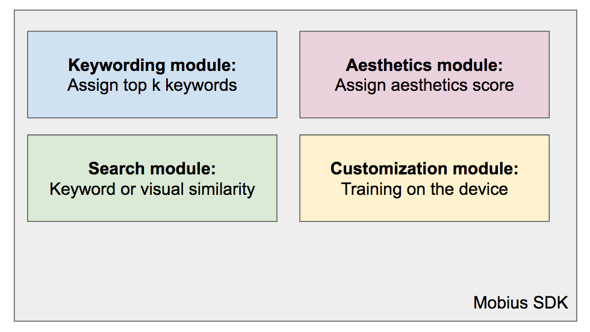

.. sdk_external_doc documentation master file, created by
   sphinx-quickstart on Thu Mar  8 11:26:18 2018.
   Index file for the external doc project for the Mobius Labs SDK.

.. image::
  data/green_Mobius_Vision_Logotype.png
  :align: left

AI powered Computer Vision that lives on the Edge
======================================================
Empower your product with our pre-trained models.
Our technology is engineered to work on Android smart phones.
We believe that privacy matters even in the 21st century, and therefore all
processing happens on the device locally, and not a cloud.

We currently offer four modules:

* Keywording module: Tag images with more than 5000 general keywords
* Aesthetics module: Estimate image aesthetics (based on professional curators' style)
* Search module: Return similar images given query image or keywords
* Customisation module: Add custom keywords and/or style

.. toctree::
   :maxdepth: 2
   :caption: Contents:

   about-tech
   installation
   getting-started
   image-search
   advanced-training
   best-practices
   faq
