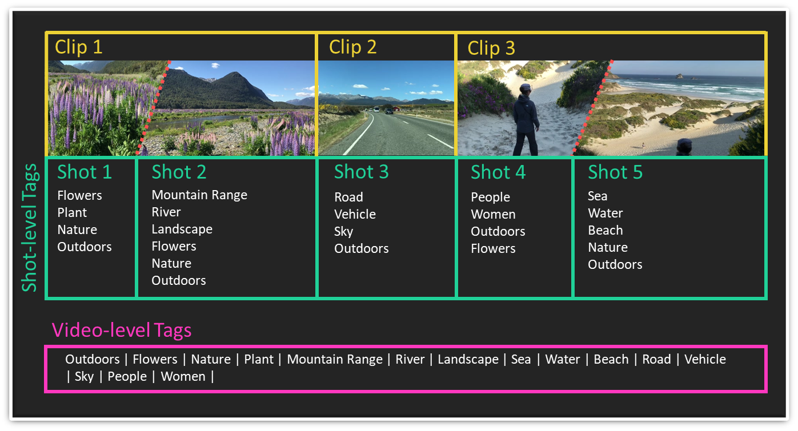

About Mobius Vision Video SDK
======================================

A video can be seen as a sequence of images, which are called frames. Video content is typically recorded at 24 to 60 frames per second (fps), and typically is much larger than an image. For this reason, it makes most sense to process video content on-premise, rather than a cloud-based API, which would incur serious delays in the video processing pipeline. In some cases, such as for real-time applications, cloud-based solutions are even prohibitive.

|mobvis_video| is shipped with a video shot detection module, as well as a keywording and action recognition module, which are briefly summarized in the following. 

Video Tagging
-------------

|mobvis_video| offers a lightweight keywording model, which can identify over 5000 concepts and emotions in videos in real-time.

Since content can change quite drastically within a video, we offer both 'segment-level' as well as 'video-level' keywording. As the names suggest, segment-level keywording finds keywords for each individual segment, whereas video-level keywording provides keywords that are representative of the whole video. See the section 'Video Shot Detection' at the end of this page for more information.

(Soon) Highlights Detection
----------------------------

We are currently working hard to add a video highlighting feature to the |mobvis_video|. This feature allows to obtain 'highlight scores' for video segments, which can be used to identify the most important parts of a video. This can be very useful for example in order to create a summary of a video that can be shown if someone is browsing through a video database, or to identify the highlights in a recording of unedited video.

Below is an example of a video that can benefit from highlighting. Someone is standing on the side of a motocross race, waiting for the race to start. Our highlight detector is able to identify the point where the race actually starts, as identified by the spike of the highlight scores towards the end of the clip. Note that depending on the length and type of video, there can be numerous (or none) highlights detected by our highlights detector.

.. raw:: html
    
    

    <video controls src="_static/video_highlight_motostart.mp4" width="400px"></video>
    
    
    

Video Shot Detection
--------------------

An important concept in videos is the one of 'shots'. While there are several definitions of what a shot is, for our intents and purposes, we define a shot as a sequence of frames where the semantics (that is, the content) only changes slowly. In order to perform a meaningful analysis of a video, it is highly beneficial to identify so-called 'video shot boundaries', or 'shot boundaries' for short. 

The figure below further illustrates the concept of 'shot boundaries', on the example of a short video that has been created from three separate 'clips'. Note that each clip is a video that has been recorded at one go, without turning the camera off. As one can see, while there are only *three clips* in the video, there are actually *five shots* detected. This is because the concent of the scene (and hence the concepts) change over time, even within a clip. In the first clip of the illustration, for example, the camera pans from a close-up of the flowers to the landscape shot of the mountain range with the river, which causes a 'shot' change.

   
   
The |mobvis_video| features a highly efficient shot boundary detector. With the shots identified, the SDK offers a shot-level keywording module, as well as an action detection module. 

.. note::
    
If the shot boundary selection is switched off, the video will be segmented using *fixed* temporal segments (e.g., 3 seconds).

